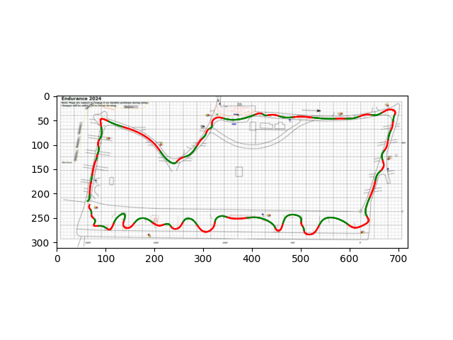
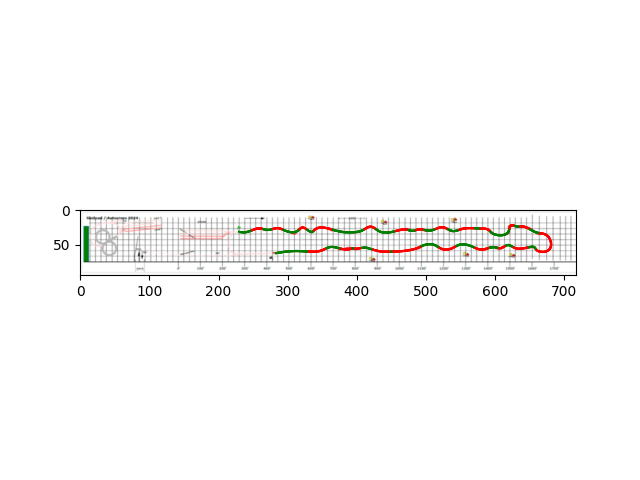

# bfr-track-trace

## Architecture

* `read_img.py` converts track to point file (in `points` folder). 
* `draw_spline.py` uses point file to approximate spline, and saves csv data to `spline_data` folder.
* Use `requirements.txt` to install dependencies. 
* Put input images in `images` folder.
* See result images in `results` folder.

## Instructions
Run the following:

    python3 read_img.py -f <IMAGE NAME>
    python3 draw_spline.py -f <IMAGE NAME>

* Make sure the input image has been saved in the `images` folder. 
* `--filename` or `-f` corresponds to input image file name.
* *Example call: If the file name is `sample_image.png`, our calls might be:*
    * `python3 read_img.py -f sample_image.png`
    * `python3 draw_spline.py -f sample_image.png`

**Optional Arguments For `draw_spline.py`**
* `--smoothing` corresponds to smoothing factor for spline approximation in `draw_spline.py`. Default is 500 (but can go down to ~100 for more granularity on larger track).
    * *Example call: If the file name is `sample_image.png`,and we want smoothing of 300, our call might be
        * `python3 draw_spline.py -f sample_image.png --smoothing 300`
* `--close_loop` will manually ensure a closed track in `draw_spline.py`. Default is False; this should only be used for the larger track where there exists a closed track to be drawn. 
    * *Example call: If the file name is `sample_image.png` and we want to close the loop, our calls might be:*
        * `python3 read_img.py -f sample_image.png --close_loop` 

## Results

### End Notes

Made October 2024 by Eva Schiller (with help from GenAI).
Contact me (Eva) with questions!

