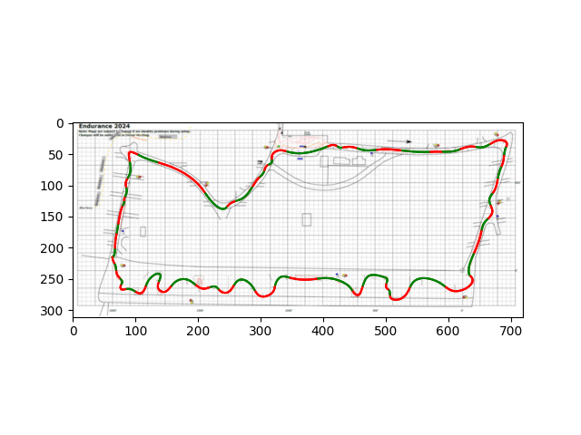

# bfr-track-trace

`read_img.py` converts track to point file (in `points` folder). 
`draw_spline.py` uses point file to approximate spline, and saves csv data to `spline_data`

Use `requirements.txt` to install dependencies. 

Contact Eva Schiller with questions!
